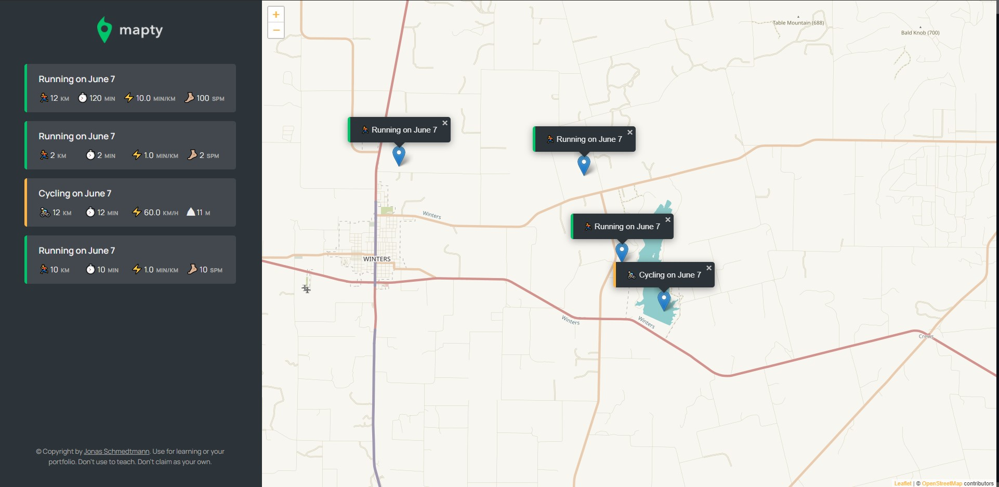

# Mapty

this is a practice project from [Jonas Schmedtmann](https://www.udemy.com/user/jonasschmedtmann/)'s [JavaScript course](https://www.udemy.com/course/the-complete-javascript-course/)

# Screenshot || [Live Demo](https://captkraken.github.io/mapty/)

### *not mobile friendly

# what i did

added a error message popup ( errorMessage() ) & a toast notification thingy ( toastMessage() )

i converted the localstorage data to objects again. go check \_getLocalStorage() & \_newWorkout() they still have their data intact. (i spent like half an hour wondering why the data has the same id lol)
not sure if what i came up with is an efficient way of doing it, but im gonna to sleep now.

